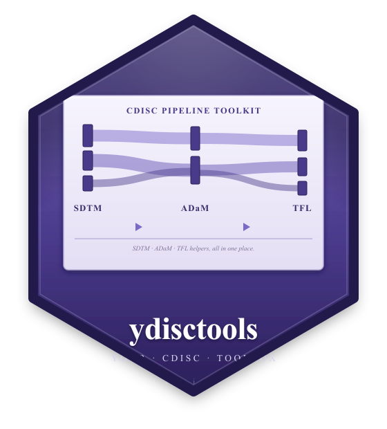
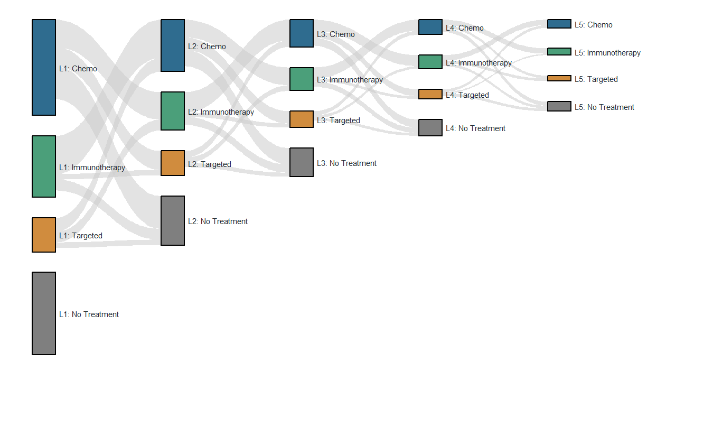
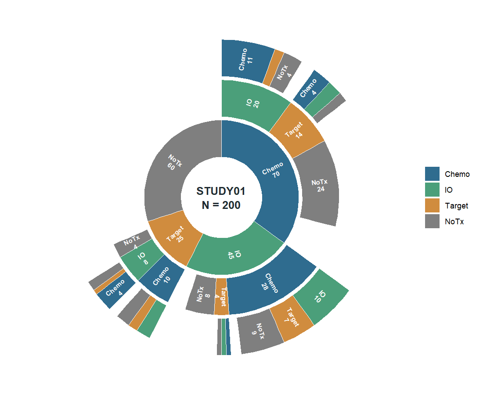

<!-- README.md is generated from README.Rmd. Please edit that file -->


# ydisctools 

<!-- badges: start -->
[](https://github.com/ichirio/ydisctools/actions/workflows/R-CMD-check.yaml)
[](https://github.com/ichirio/ydisctools/actions/workflows/pkgdown.yaml)
[](https://lifecycle.r-lib.org/articles/stages.html#experimental)
[-blue.svg)](https://www.gnu.org/licenses/gpl-3.0)
<!-- badges: end -->

`ydisctools` **implements, experimentally, features for clinical reporting and
database research** — SDTM/ADaM dataset building, Define-XML / Pinnacle 21
metadata reading, ISO 8601 date helpers, controlled-terminology lookups,
byte-aware text splitting, an ARS (CDISC Analysis Results Standard) toolchain
from the SAP down to the tables, and treatment-pattern plotting
(`plot_sankey()` / `plot_sunburst()`).

It is a **proof-of-concept workshop** by design: many small utilities live
side by side so their usefulness can be tested in practice. Tools judged
useful graduate — they are **reorganized and published as standalone
packages**. That is exactly how
[rtfreporter](https://github.com/ichirio/rtfreporter) began, as the
RTF-reporting code inside ydisctools before it was spun out on its own. There
is no CRAN submission planned for ydisctools itself, and the API may change at
any time.

## Installation

You can install the development version of ydisctools from [GitHub](https://github.com/ichirio/ydisctools) with:

``` r
# install.packages("pak")
pak::pak("ichirio/ydisctools")
```

## Documentation

Full documentation is published with [pkgdown](https://pkgdown.r-lib.org/):

- **Website:** <https://ichirio.github.io/ydisctools/>
- **Function reference:** <https://ichirio.github.io/ydisctools/reference/>
- **Changelog:** <https://ichirio.github.io/ydisctools/news/>

## Treatment-pattern plots

Two static, publication-ready views of **one treatment-sequence cohort**
(fully `ggplot2`-native — no htmlwidgets). `plot_sankey()` answers the
*transition* question — who moves where between treatment lines. Nodes are
laid out from the node table, not inferred from the links, so a node with no
links at all ("L1: No Treatment" below) is still drawn:

<div class="figure">

<p class="caption">plot of chunk sankey</p>
</div>

`plot_sunburst()` answers the *path* question on the same cohort — the full
treatment sequences (here the first three lines): each ring is a line, arc
length is patients, and the empty remainder of a parent arc is the attrition,
the sunburst counterpart of the sankey's unlinked node span:

<div class="figure">

<p class="caption">plot of chunk sunburst</p>
</div>

The full runnable code for both figures — including how the sankey's node and
link tables are derived from the sunburst's path table — is in the
[`plot_sankey()`](https://ichirio.github.io/ydisctools/reference/plot_sankey_polygon.html)
and
[`plot_sunburst()`](https://ichirio.github.io/ydisctools/reference/plot_sunburst.html)
reference examples.
